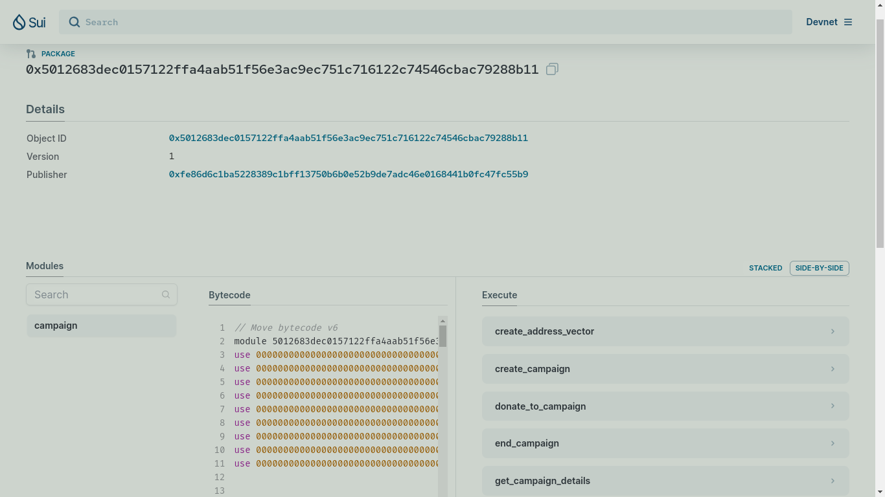

# SUI Campaign

The **sui campaign** is a DEFI smart contract built on the SUI blockchain using the sui flavour of the Move programming language.

## About

This smart contract allow users create and dontate to campaigns. At this moment, campaigns are limited to one per user. Campaigns can be ended by the Admin, and can no longer receive donations when in an ended state.

## Installation and Environment Setup

To interact with this smart contract, complete the following steps to get your environment up and running.

1. Clone this repo to your local machine and `cd` into the directory.

2. Install dependencies by running the following commands (feel free to skip if you have all these installed):

   - `sudo apt update`

   - `sudo apt install curl git-all cmake gcc libssl-dev pkg-config libclang-dev libpq-dev build-essential -y`

3. Install Rust and Cargo

   - `curl https://sh.rustup.rs -sSf | sh`

   - source "$HOME/.cargo/env"

4. Install Sui Binaries

   - run the command `chmod u+x sui-binaries.sh` to make the file an executable

   execute the installation file by running

   - `./sui-binaries.sh "v1.20.0" "devnet" "ubuntu-x86_64"` for Debian/Ubuntu Linux users

   - `./sui-binaries.sh "v1.20.0" "devnet" "macos-x86_64"` for Mac OS users with Intel based CPUs

   - `./sui-binaries.sh "v1.20.0" "devnet" "macos-arm64"` for Silicon based Mac

After completing the steps above, follow the guide in [this video](https://youtu.be/Ypmjzy_QRM8) to setup your sui wallet (only available on Chrome-based browsers at the moment) and get SUI test tokens for development purposes.

## Build and Deploy the smart contract

In the cloned directory of the smart contract, run the following commands.

1. Build

   - `sui move build`

2. Deploy/Publish
   - `sui client publish --gas-budget 1000000000`

**OR**

If you have node.js and npm installed, you can run these instead.

1. Build

   - `npm run build`

2. Deploy/Publish
   - `npm run deploy`

## Object Structure

1. Campaign

   ```
   {
      id: UID,
      title: String,
      about: String, // a breif description of the campaign
      ended: bool,
      creator: address,
      received: Balance<SUI>,
      donations: vector<DonationReceipt>,
      started_at: u64,
      ended_at: Option<u64>
   }
   ```

2. Donation

   ```
   {
      id: UID,
      donor: address,
      campaign: ID,
      amount_donated: u64,
      donated_at: u64
   }
   ```

3. Withdrawl

   ```
   {
      id: UID,
      campaign_id: ID,
      amount_withdrawn: u64,
      withdrawn_at: u64
   }
   ```

4. AdminCap

   ```
   {
      id: UID
   }
   ```

5. CampaignOwnerCap

   ```
   {
      id: UID,
      campaign_id: ID
   }
   ```

6. OwnerAddressVector

   ```
   {
      id: UID
      addresses: vector<address>
   }
   ```

7. DonationReceipt

   ```
   {
      id: UID,
      donation_id: ID
   }
   ```

8. CampaignDetails

```
{
    id: UID,
    ended: bool,
    started_at: u64,
    amount_donated: u64,
    num_of_donations: u64,
    campaign_title: String,
    campaign_about: String,
  }
```

## Errors

- ENotCampaignOwner: u64 = 0;
- EInsufficientBalance: u64 = 1;
- EMaxCampaignsReached: u64 = 2;
- ECampaignEndedAlready: u64 = 3;
- EDonationNotAllowed: u64 = 4;

## Functions

### init

- **Description**: Initializes the Campaign smart contract by creating an admin account.

### create_address_vector

- **Parameters**:

  - admin_cap: `&AdminCap`
  - ctx: `&mut TxContext`

- **Description**: creates the `OwnerAddressVector` vector object used for storing the addresses of campaign owners.

### create_campaign

- **Parameters**:

  - title: `String`
  - about: `String`
  - clock: `&Clock`
  - address_vector: `&mut OwnerAddressVector`
  - ctx: `&mut TxContext`

- **Description**: creates a campaign if the caller hasn't created one previously.

- **Errors**: Errors that can be encountered with this function.
  - **EMaxCampaignsReached**: the user already has a campaign created.

### donate_to_campaign

- **Parameters**:

  - amount: `Coin<SUI>`
  - campaign: `&Campaign`
  - clock: `&Clock`
  - ctx: `&mut TxContext`

- **Description**: donates the specified `amount` to the campaign.

- **Errors**: Errors that can be encountered with this function.

  - **ECampaignEndedAlready**: the campaign has been marked `ended` by the admin.

  - **EDonationNotAllowed**: the owner of the campaign attempts to donate to their own campaign.

### withdraw

- **Parameters**:

  - cap: `&CampaignOwnerCap`
  - amount: `u64`
  - campaign: `&mut Campaign`
  - clock: `&Clock`
  - ctx: `&mut TxContext`

- **Description**: withdraws the specified `amount` from the campaign.

- **Errors**: Errors that can be encountered with this function.

  - **ENotCampaignOwner**: the campaign was not created by the caller.

  - **EInsufficientBalance**: the campaign's balance is lower than the attempted withdrawal `amount`.

### get_campaign_details

- **Parameters**:

  - campaign: `&mut Campaign`
  - clock: `&Clock`
  - ctx: `&mut TxContext`

- **Description**: retrieves the details of the passed campaign and sends it to the caller's address.

### end_campaign

- **Parameters**:

  - admin_cap: `&AdminCap`
  - campaign: `&mut Campaign`
  - clock: `&Clock`

- **Description**: ends the campaign by setting its `ended` field to `true`.

- **Errors**: Errors that can be encountered with this function.
  - **ECampaignEndedAlready**: the campaign has been marked `ended` by the admin already.

## Live Interaction



To interact with a live (visual) version of this smart contract, please visit [this link](https://suiexplorer.com/object/0x5012683dec0157122ffa4aab51f56e3ac9ec751c716122c74546cbac79288b11?network=devnet). The link redirects to the `devnet` branch of the **sui explorer** with the published version of the smart contract.

## Security Considerations

- This code is provided for educational purposes only. It has not undergone a formal security audit, and there may be vulnerabilities.
- Before deploying in a production environment, conduct a thorough security review.
